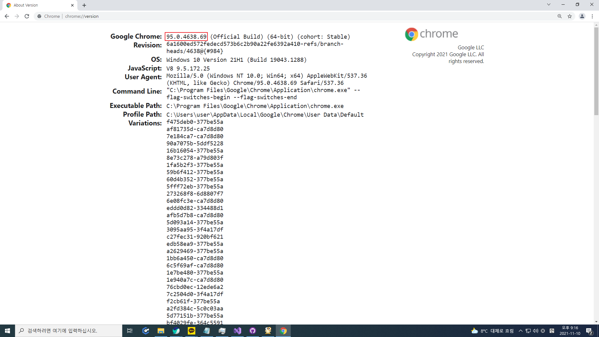
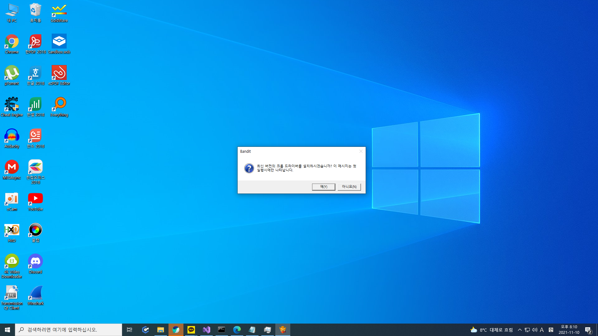
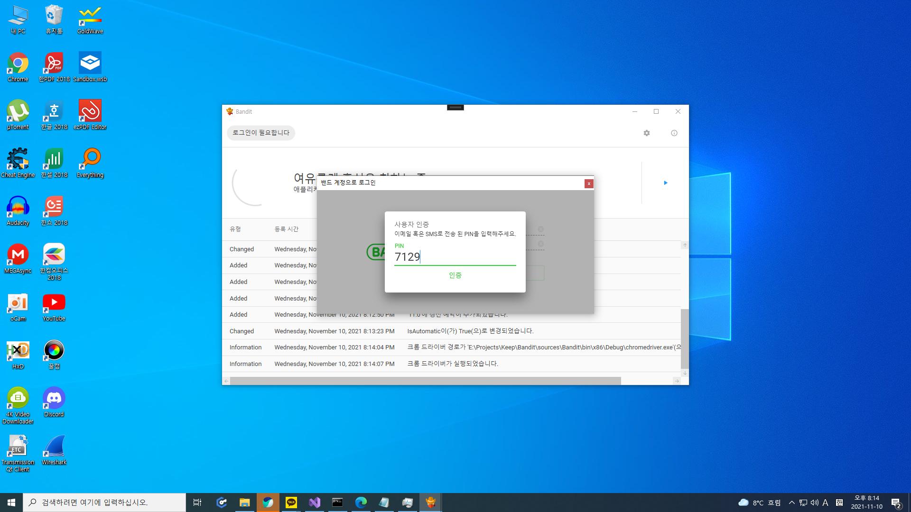
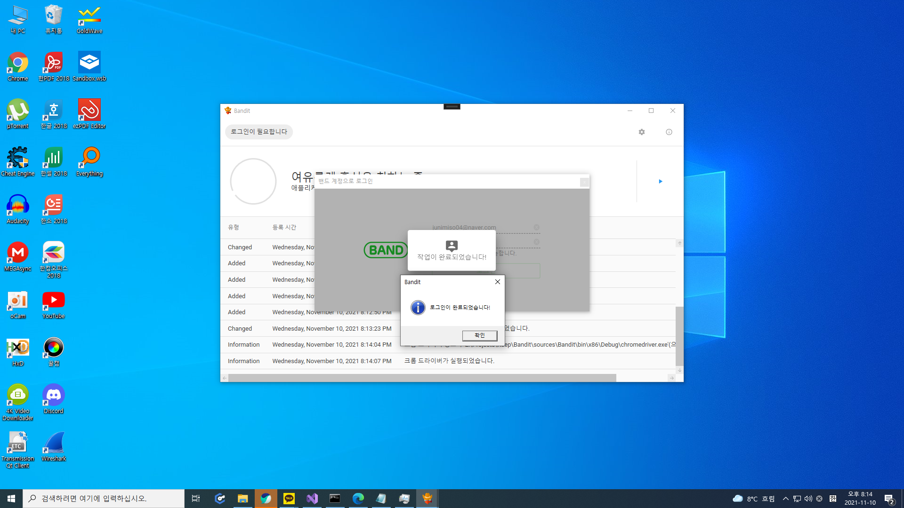
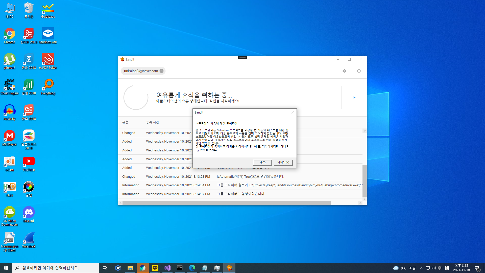
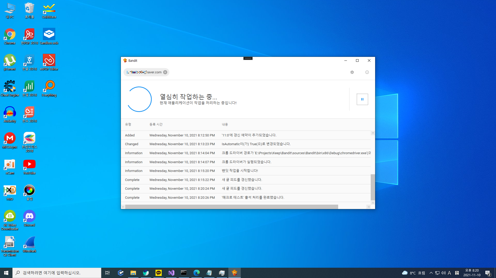
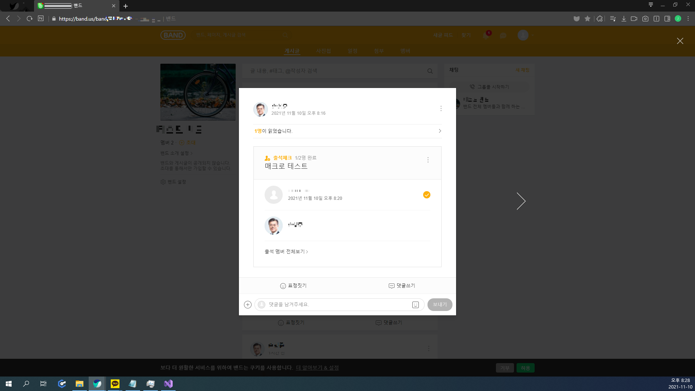

# Bandit 매뉴얼

```
🚨 주의사항
윈도우의 절전 기능을 꺼주셔야 원활한 사용이 가능합니다.
절전 기능은 '윈도우 설정 > 시스템 > 전원 및 절전 > 절전 모드'에서 설정할 수 있습니다.
```

## 1. 다운로드
[GitHub Releases](https://github.com/handbros/Bandit/releases/latest) 페이지를 통해 최신 버전의 프로그램을 다운로드하고 압축을 해제합니다.

 * 파일은 릴리즈 페이지 최하단의 Assets 구역에 있으며 __'Bandit_v1.2.0_AnyCPU.zip'__ 와 같은 형식의 이름을 가지고 있습니다.

## 2-1. 크롬 버전 확인

```
🚨 주의사항
드라이버 버전은 반드시 'chrome://version' 페이지를 통해 확인한 크롬의 버전과 동일해야 합니다.
크롬 버전과 드라이버 버전이 일치하지 않는다면 통신 오류가 발생할 수 있습니다.
```


크롬을 실행한 후 'chrome://version' 페이지에 들어가서 크롬의 버전을 확인합니다.

 * 만약 크롬 버전과 설치되어 있는 드라이버의 버전이 다르다면, 설정 창에서 크롬과 같은 버전의 드라이버를 재설치 해주시기 바랍니다. (자세한 내용은 2-2 문단 참고)

## 2-2. 설정
프로그램 패키지 파일의 압축을 해제했다면(1번 과정), 안에 포함되어 있는 __'Bandit.exe'__ 를 실행합니다.




프로그램을 처음 실행한다면 첫번째 사진과 같은 메시지가 뜨게됩니다. 별 다른 특이사항이 없다면 __예__ 를 눌러주십시오.

이후 드라이버 설치가 완료되면, 드라이버 설치 창을 닫아주시기 바랍니다.


프로그램 우측 상단에 있는 톱니바퀴 모양 버튼을 누르면 설정창이 나타납니다. 설정창에서는 아래와 같은 항목들을 설정할 수 있습니다.

 * 새 글 자동 감시 여부 : 자동 감시를 사용할 지, 특정 시각에만 갱신을 감지할 지를 선택합니다.
 * 새 글 갱신 대기 시간(분) : 몇 분 마다 새글 피드를 갱신할지를 설정합니다.
 * 현재 드라이버 버전 : 현재 설치되어 있는 크롬 드라이버 버전입니다.
 * 사용 가능한 드라이버 버전 : 설치 가능한 드라이버들의 버전 목록을 보여줍니다. 여기서 드라이버 버전을 선택한 후 오른쪽의 적용 버튼을 누르면 해당 버전의 드라이버가 설치됩니다.

* * *

 * 웹 타임아웃 대기 시간(초) : 최대 몇 초 동안 서버 응답을 대기할지를 설정합니다.
 * 헤드리스 모드 사용 여부 : 헤드리스 모드를 사용하지 않을 시, 크롬을 직접 조작할 수 있습니다. 하지만 추천하지는 않는 조작입니다.
 * 콘솔 창 사용 여부 : 프로그램의 처리 로그 콘솔의 사용 여부를 지정합니다.

* * *
 * 새 글 갱신 예약 시간 : 새글 피드를 갱신할 시간을 정합니다. 이 옵션은 새 글 자동 감시가 꺼져있을 때에만 사용 가능합니다.

## 3. 로그인
```
🚨 주의사항
이메일 계정으로만 로그인이 가능합니다.
이메일 계정이 아니라면, 밴드 프로필 설정에서 이메일을 연동해주세요.
```




프로그램 좌측 상단의 __'로그인이 필요합니다'__ 버튼을 누르면 위와 같이 로그인 창이 뜨게됩니다. 아이디와 비밀번호를 입력한 후 로그인 버튼을 클릭하면 로그인을 시도합니다.
 * 첫 로그인 시에는 사용자 인증을 위한 PIN 번호 입력이 필요할 수 있습니다. 

이후 세번째 사진과 같이 작업이 완료되었다는 메시지가 뜨면 로그인이 완료되었다는 의미입니다. 로그인이 완료되었다면 로그인 창을 닫으시면 됩니다.

## 4. 실행


로그인이 완료된 후, 설정 버튼 아래쪽에 있는 실행 버튼을 클릭하고, 면책사항에 동의하시면 출석 작업이 진행됩니다.

__'새 글 피드를 갱신했습니다.'__ 라는 메시지가 뜬다면 작업이 정상적으로 시작된 것입니다.

## 5. 테스트


이후 실사용 혹은 테스트를 통해 출석 처리를 완료했다는 로그가 뜨면 성공입니다.
