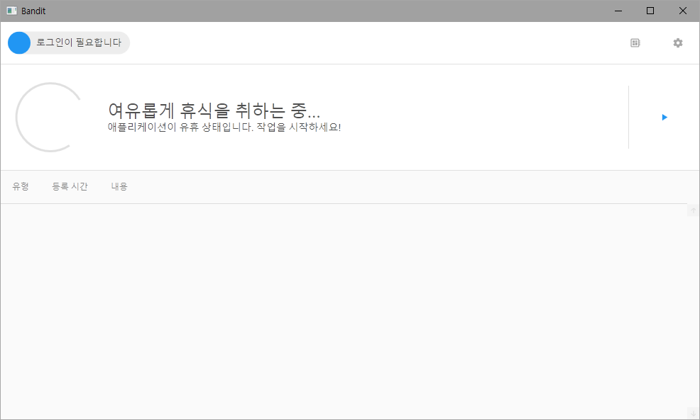

# Bandit
[](https://hits.seeyoufarm.com)
[](https://github.com/junimiso04/Bandit/releases)
[](https://github.com/junimiso04/Bandit/blob/master/LICENSE)

| |master|develop|
|------|------|------|
|Code Quality(Codacy)|[](https://app.codacy.com/manual/junimiso04/Bandit/dashboard)|[](https://app.codacy.com/manual/junimiso04/Bandit/dashboard)|
|Build State(AppVeyor)|[](https://ci.appveyor.com/project/junimiso04/bandit)|[](https://ci.appveyor.com/project/junimiso04/bandit)|

당신의 멘탈과 더불어 가정의 화목함을 지켜줄 유일한 친구, 노상강도 입니다.

## Overview
밴딧은 네이버 밴드를 이용한 원격 수업 중 출석체크의 피곤함을 덜어주기 위해 만들어진 도구입니다. 밴딧은 Selenium 프로젝트와 Chrome을(를) 사용하여 출석을 자동화해줍니다.

## Screenshots


## Install
[GitHub Releases](https://github.com/junimiso04/Bandit/releases)을(를) 통해 Bandit의 최신 릴리즈를 다운로드하실 수 있습니다.
 * Bandit은(는) Windows 7 서비스 팩 1 이후 버전의 Windows 환경에서만 사용할 수 있습니다.
 * 32비트 시스템에서는 **Bandit_(릴리즈 버전)_i386.zip**을(를), 64비트 시스템에서는 **Bandit_(릴리즈 버전)_amd64.zip**을(를) 다운로드 해주시기 바랍니다.
 * 프로그램을 사용하시려면 배포 패키지의 압축을 해제하시고 __Bandit.exe__(을)를 실행하십시오.
 
만약 프로그램이 실행되지 않거나, 런타임 도중 오류가 발생한다면 아래의 사항들을 점검해주시기 바랍니다.
 * 사용자의 시스템에 맞는 패키지를 다운로드 받지 않았을 경우.
 * 패키지의 압축을 풀지 않고 프로그램을 실행했을 경우.
 * 패키지에 동봉되어 있는 DLL(Dynamic Link Library)의 일부가 손실되었을 경우.
 * 사용자의 컴퓨터에 .NET Framework 4.8 런타임이 설치되어 있지 않을 경우.

## Usage
밴딧을 사용하기 위해서는 사용자의 컴퓨터에 Chrome 브라우저가 설치되어 있어야합니다. 크롬이 설치되어 있지 않을 경우에는 이 [링크](https://www.google.com/intl/en/chrome/)를 통해 크롬을 설치할 수 있습니다.

크롬이 설치되어 있다면 크롬을 실행한 뒤, 주소창에 __chrome://version/__ 을(를) 입력하여 사용자의 컴퓨터에 설치된 크롬의 버전을 확인한 후 밴딧 설정에서 해당 버전에 알맞는 크롬 드라이버 버전을 설치해주시기 바랍니다.

## Description
밴딧의 동작 과정을 살펴보기에 앞서 밴딧에는 두가지의 동작 모드가 있습니다. 하나는 일정 시간(Tick)마다 동작 시퀀스를 실행하는 모드이며, 다른 하나는 지정된 시간에만 동작 시퀀스를 실행하는 모드입니다. 이 두 모드는 프로그램 내에서 사용자 지정이 가능하며 이를 위한 설정창까지 마련되어 있습니다.

밴딧의 자세한 동작 과정은 아래와 같습니다.

```
 # 작업 전 처리 #
 
 1. 사용자의 컴퓨터에 설치된 크롬과 크롬 드라이버의 버전 호환 여부를 검사합니다. 
 2. 밴드 로그인을 진행합니다.
 
 # 동작 시퀀스 #
 
 1-1. 새 글 피드의 내용을 가져옵니다. 
 1-2. 새 글 피드에 존재하는 게시글들의 주소를 가져옵니다. 
 1-3. 이미 출석 작업이 완료된 게시글들의 목록과 새롭게 가져온 게시글들을 비교하여 아직 출석 작업이 진행되지 않은 글들을 골라냅니다.
 1-4. 골라낸 게시글들에서 출석 체크를 담당하는 input 태그를 감지하여 클릭함으로서 출석 작업을 완료합니다.
 
```

## TO-DO
 * 한 게시물에서 여러개의 출석 체크를 처리하기.
 * 여러 게시물이 동시에 입력될 경우에 제일 최근에 작성된 게시물의 출석만 처리되는 오류를 해결하기.
 * 코드 최적화 및 주석 정리하기.
 * 추가적인 예외 경우 처리하기.

## Open-source License
본 레포지토리의 모든 소스 코드는 MIT 라이선스에 의거하여 자유롭게 사용이 가능합니다. (단, 본 레포지토리에서 이용된 제 3자 오픈소스 프로젝트들은 각 프로젝트에 부여된 라이선스를 기반으로 사용이 가능합니다.)

 * __DotNetSeleniumExtras.WaitHelpers__ - Unknown License
 * __DotNetZip.Semverd__ - Microsoft Public License(MS-PL)
 * __HtmlAgilityPack__ - MIT License
 * __MaterialDesignThemes__ - MIT License
 * __MaterialDesignColors__ - MIT License
 * __Newtonsoft.Json__ - MIT License
 * __Selenium.Support__ - Apache License Version 2.0
 * __Selenium.WebDriver__ - Apache License Version 2.0
 * __Selenium.WebDriver.Chromedriver__ - Unlicense
 
## Contributers
__Main Developer(+Maintainer)__ - 손형준 / Syri(aka junimiso04)

## Contact
본 레포지토리의 소스 코드에 대한 문의사항이나 릴리즈 된 프로그램에 대한 버그 정보를 제공하시려면 GitHub Issues(이)나 아래의 이메일을 이용해주시기 바랍니다.

 * E-Mail : junimiso04@naver.com
